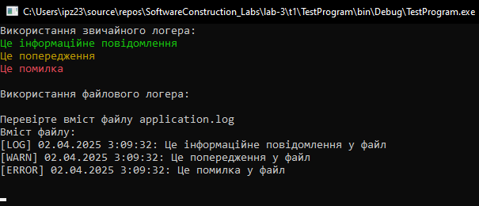
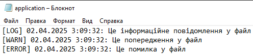
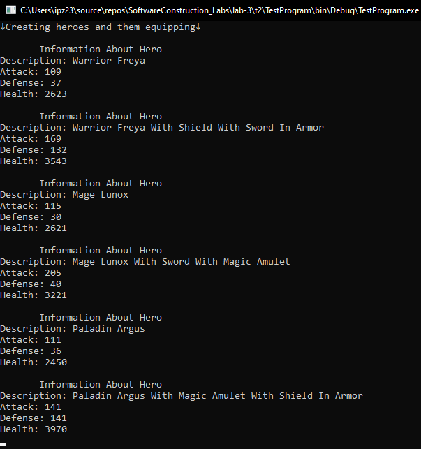
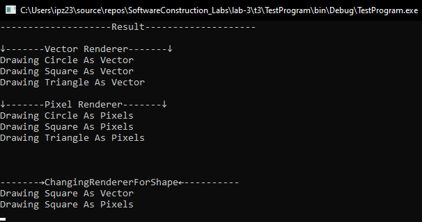
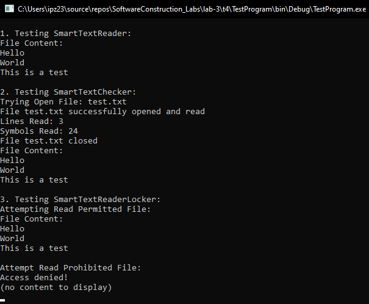
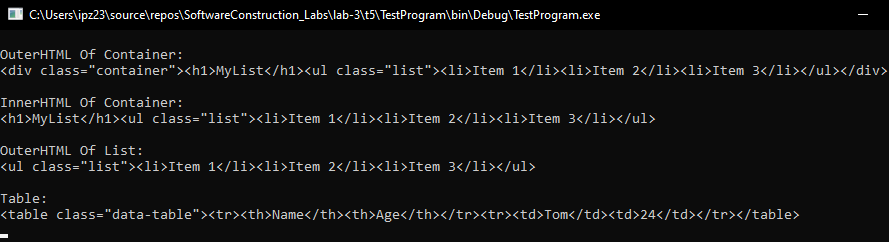
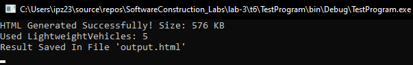
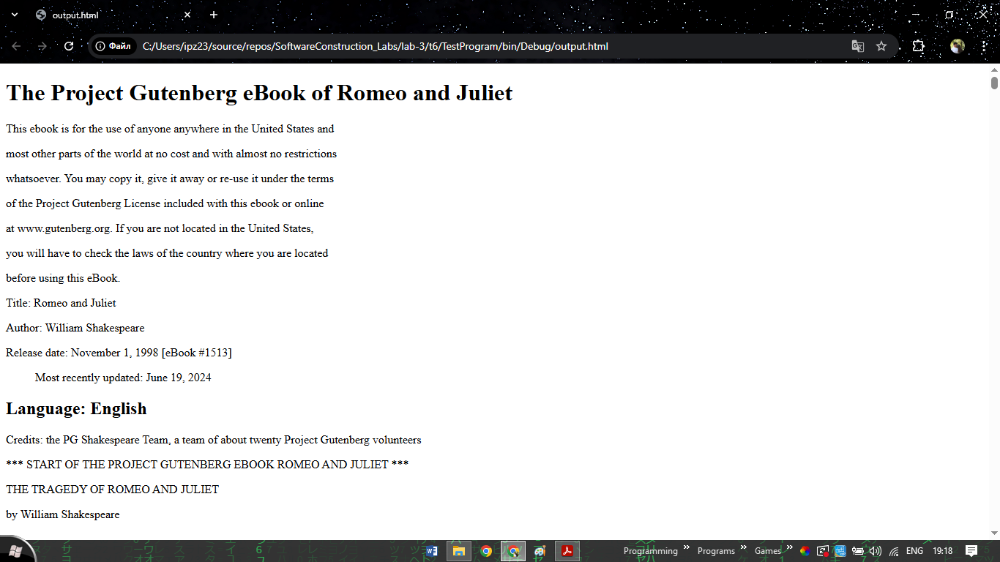

# Лабораторна робота №3

### Завдання 1

- Результат виконання програми

- Вигляд файлу (створеного в завданні)

### Завдання 2

- Результат виконання програми

### Завдання 3

- Результат виконання програми

### Завдання 4

- Результат виконання програми

### Завдання 5

- Результат виконання програми

### Завдання 6

- Результат виконання програми

- Вигляд файлу (створеного в завданні)

