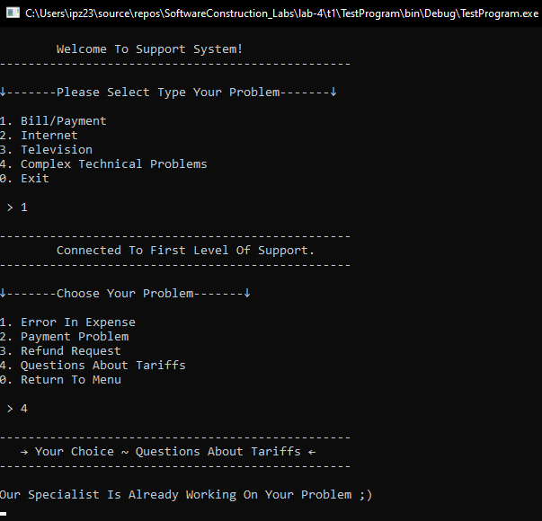
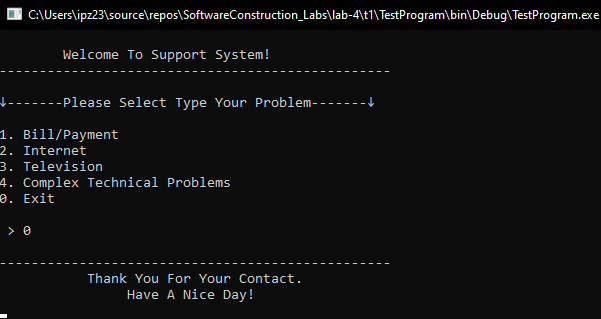
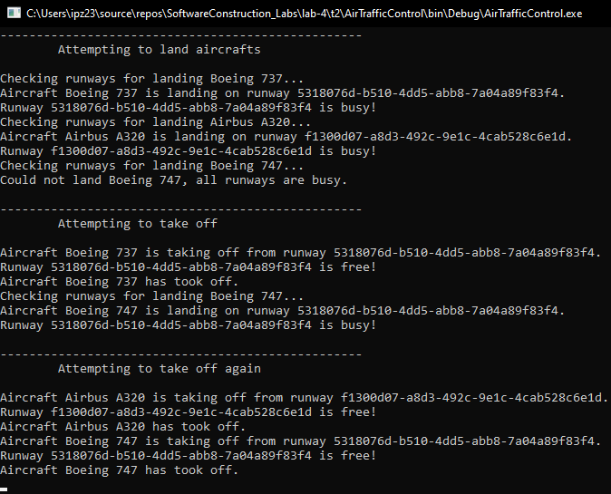
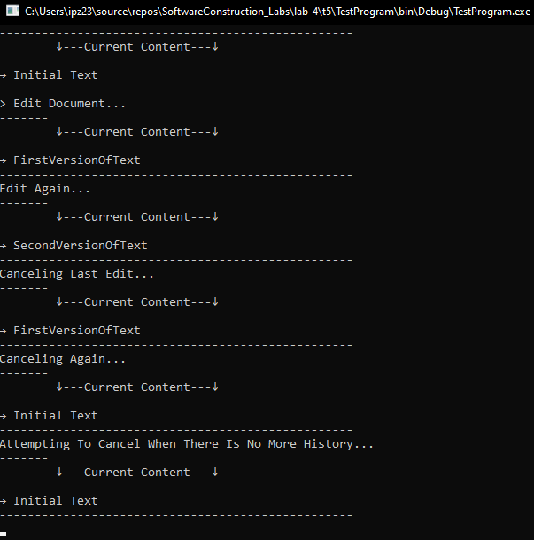

# Лабораторна робота №4

### Завдання 1

- Результат виконання програми

- Результат виконання програми (Вихід)

### Завдання 2

- Результат виконання програми

### Завдання 5

- Результат виконання програми

